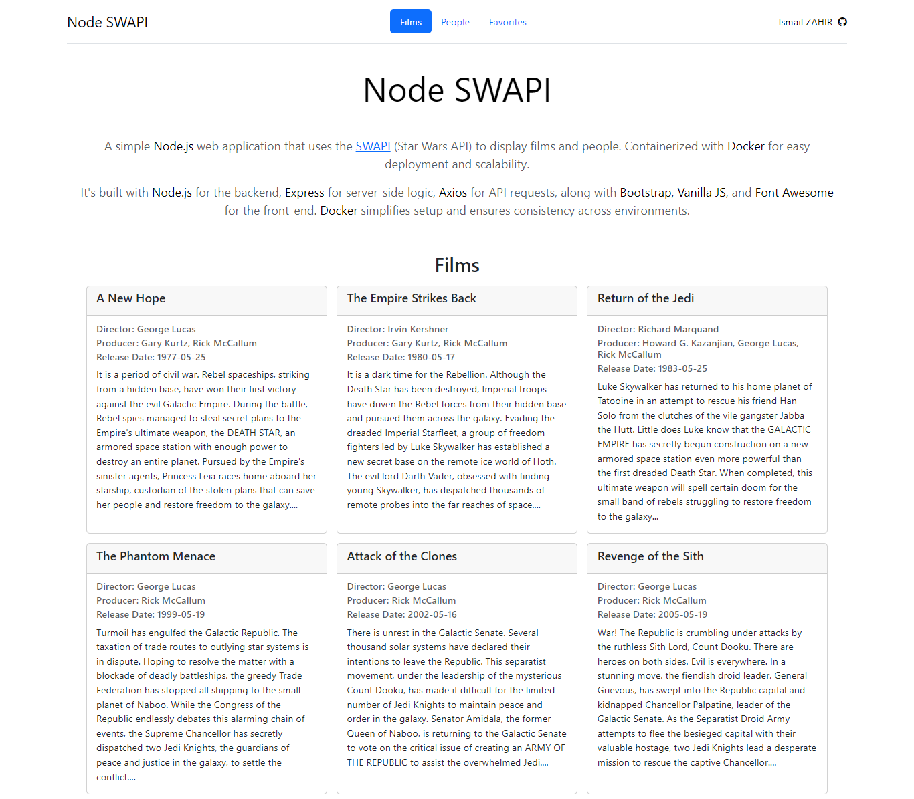

# Node SWAPI

This repository contains a simple Node.js web application that utilizes the [Star Wars API (SWAPI)](https://swapi.dev/) to display information about Star Wars films and characters. The application is built with Express for server-side logic, Axios for making API requests, and integrates Bootstrap, Vanilla JavaScript, and Font Awesome for the frontend. Containerized with Docker, it offers easy deployment and scalability, ensuring consistency across different environments.




## Features

- Display a list of Star Wars films and people from the SWAPI.
- Modern, responsive UI built with Bootstrap and Font Awesome.
- Backend API integration using Axios in a Node.js/Express environment.
- Docker containerization for simplified setup and deployment.

## Getting Started

To get a local copy up and running follow these simple steps.

### Prerequisites

- [Docker](https://www.docker.com/products/docker-desktop)
- [Node.js](https://nodejs.org/en/download/) (optional if you want to run the application without Docker)
- [MongoDB](https://www.mongodb.com/try/download/community) 

    Pull the MongoDB Docker image and run a container:
    ```bash
        docker pull mongo
        docker run -d -p 27017:27017 --name mongodb mongo
    ```

### Installation

1. Clone the repository
    ```git
    git clone https://github.com/ismailza/node-swapi.git
    ```

2. Navigate to the project directory
    ```bash
    cd node-swapi
    ```

3. Build the Docker image
    ```bash
    docker build -t node-swapi .
    ```

4. Run the Docker container
    ```bash
    docker run -p 3000:3000 -d node-swapi --link mongodb:mongodb
    ```

    Note: Change `mongodb` to the name of your MongoDB container if you are using a different name.

  The `-p 3000:3000` flag maps port 3000 on the host to port 3000 on the container.

The application should now be running in the Docker container.

5. Open your browser and navigate to `http://localhost:3000`

## Contributing

Contributions are what make the open-source community such an amazing place to learn, inspire, and create. Any contributions you make are greatly appreciated.

## License
This project is licensed under the [MIT License](LICENCE) - see the LICENSE file for details.
